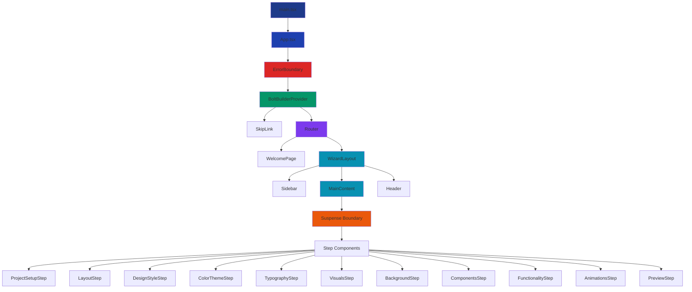
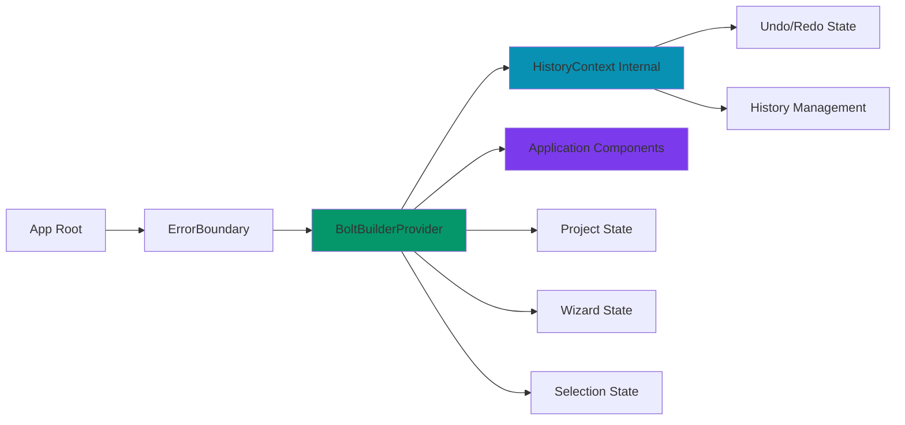
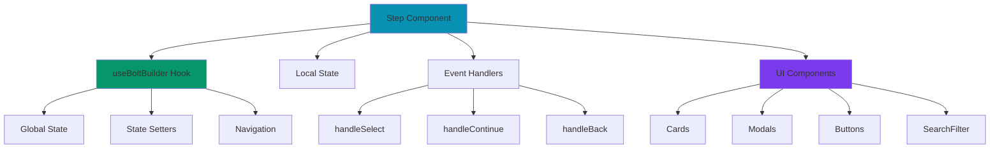
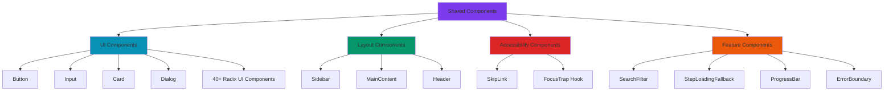
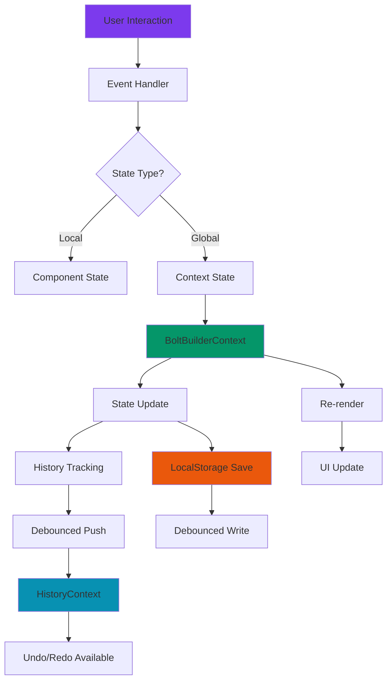
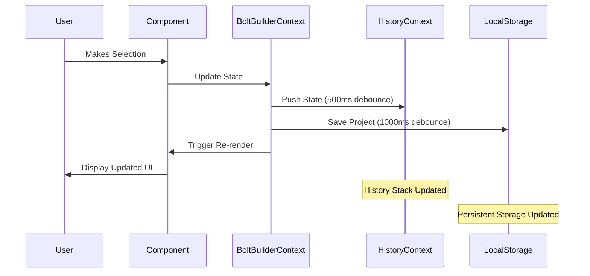
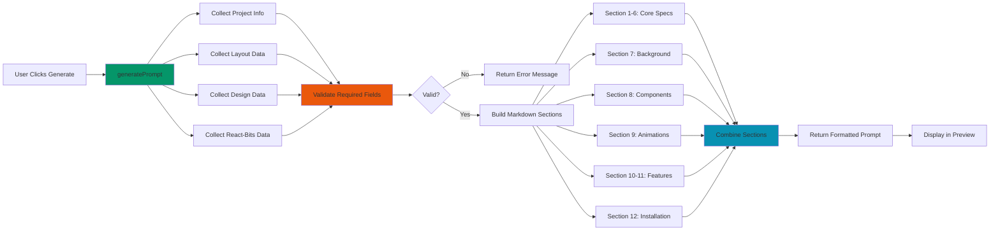

# LovaBolt Architecture Documentation

## Table of Contents

1. [Overview](#overview)
2. [Component Hierarchy](#component-hierarchy)
3. [Data Flow](#data-flow)
4. [State Management](#state-management)
5. [File Organization](#file-organization)
6. [Key Design Decisions](#key-design-decisions)
7. [Performance Optimizations](#performance-optimizations)
8. [Accessibility Architecture](#accessibility-architecture)

## Overview

LovaBolt is a wizard-based web application built with React, TypeScript, and Tailwind CSS. It guides users through creating comprehensive project specifications for AI-powered development. The application uses a multi-step wizard interface with persistent state management, undo/redo functionality, and accessibility features.

### Technology Stack

- **Framework**: React 18 with TypeScript
- **Styling**: Tailwind CSS with custom glassmorphism design
- **Routing**: React Router v6
- **State Management**: React Context API with custom hooks
- **Build Tool**: Vite
- **Icons**: Lucide React
- **UI Components**: Custom components with Radix UI primitives

### Core Features

- 11-step wizard interface for project specification
- Real-time state persistence with LocalStorage
- Undo/redo functionality with history management
- Keyboard shortcuts for power users
- Search and filter for 93+ React-Bits components
- Accessibility compliance (WCAG 2.1 AA)
- Code splitting and lazy loading for performance
- Responsive design with mobile-first approach

## Component Hierarchy

### Application Structure



### Context Providers



### Step Component Pattern



### Shared Components



## Data Flow

### State Flow Architecture



### Data Persistence Flow



### Prompt Generation Flow



## State Management

### BoltBuilderContext Architecture

The application uses a centralized Context API pattern for global state management. This provides a single source of truth for all wizard selections and project data.

#### State Categories

1. **Wizard Navigation State**
   - `currentStep`: Current wizard step identifier
   - `progress`: Calculated completion percentage

2. **Project Information State**
   - `projectInfo`: Basic project metadata (name, description, type, purpose)

3. **Design Selection State**
   - `selectedLayout`: Primary layout choice
   - `selectedSpecialLayouts`: Additional layout features
   - `selectedDesignStyle`: Design aesthetic choice
   - `selectedColorTheme`: Color palette selection
   - `selectedTypography`: Typography settings

4. **Feature Selection State**
   - `selectedFunctionality`: Functionality tier and features
   - `selectedVisuals`: Visual elements and effects

5. **React-Bits Selection State**
   - `selectedBackground`: Background effect choice
   - `selectedComponents`: UI component selections (array)
   - `selectedAnimations`: Animation selections (array)
   - `backgroundSelection`: Comprehensive background data

6. **Prompt State**
   - `promptText`: Generated prompt content
   - `promptType`: 'basic' or 'detailed'

#### State Update Pattern

```typescript
// Single selection pattern
const handleSelect = (option: OptionType) => {
  setSelectedOption(option);
};

// Multiple selection pattern (toggle)
const handleToggle = (option: OptionType) => {
  setSelectedOptions((prev) =>
    prev.some((item) => item.id === option.id)
      ? prev.filter((item) => item.id !== option.id)
      : [...prev, option]
  );
};

// Functional updates for arrays
setSelectedComponents((prev) => [...prev, newComponent]);
```

### History Management (Undo/Redo)

The application implements a custom history management system using the Command pattern.

#### History State Structure

```typescript
interface HistoryState<T> {
  past: T[];      // Previous states (for undo)
  present: T;     // Current state
  future: T[];    // Future states (for redo)
}
```

#### History Operations

1. **Push State**: Adds current state to past, sets new state as present, clears future
2. **Undo**: Moves present to future, restores last past state
3. **Redo**: Moves present to past, restores first future state
4. **Clear**: Resets all history to initial state

#### Debouncing Strategy

- **History Push**: 500ms debounce to prevent excessive entries during rapid changes
- **LocalStorage Save**: 1000ms debounce to reduce I/O operations

```typescript
// History tracking with debouncing
useEffect(() => {
  const timer = setTimeout(() => {
    pushState(currentState);
  }, 500);
  return () => clearTimeout(timer);
}, [dependencies]);
```

### LocalStorage Persistence

#### Save Strategy

```typescript
const saveProject = () => {
  const projectData = {
    // All state fields
    savedAt: new Date().toISOString()
  };
  localStorage.setItem('lovabolt-project', JSON.stringify(projectData));
};
```

#### Load Strategy

```typescript
useEffect(() => {
  try {
    const saved = localStorage.getItem('lovabolt-project');
    if (saved) {
      const projectData = JSON.parse(saved);
      loadProject(projectData);
    }
  } catch (error) {
    // Clear corrupted data
    localStorage.removeItem('lovabolt-project');
  }
}, []);
```

#### Error Handling

- Try-catch blocks around all localStorage operations
- Automatic cleanup of corrupted data
- Graceful degradation if localStorage unavailable
- Detailed error logging for debugging

## File Organization

### Directory Structure

```
src/
├── components/
│   ├── steps/              # Wizard step components (11 steps)
│   │   ├── ProjectSetupStep.tsx
│   │   ├── LayoutStep.tsx
│   │   ├── DesignStyleStep.tsx
│   │   ├── ColorThemeStep.tsx
│   │   ├── TypographyStep.tsx
│   │   ├── VisualsStep.tsx
│   │   ├── BackgroundStep.tsx
│   │   ├── ComponentsStep.tsx
│   │   ├── FunctionalityStep.tsx
│   │   ├── AnimationsStep.tsx
│   │   └── PreviewStep.tsx
│   │
│   ├── layout/             # Layout components
│   │   ├── Sidebar.tsx
│   │   ├── MainContent.tsx
│   │   └── Header.tsx
│   │
│   ├── ui/                 # Base UI components (40+ components)
│   │   ├── Button.tsx
│   │   ├── Input.tsx
│   │   ├── Card.tsx
│   │   ├── Dialog.tsx
│   │   ├── SearchFilter.tsx
│   │   ├── StepLoadingFallback.tsx
│   │   └── ... (Radix UI components)
│   │
│   ├── accessibility/      # Accessibility components
│   │   └── SkipLink.tsx
│   │
│   ├── WelcomePage.tsx
│   ├── WizardLayout.tsx
│   └── ErrorBoundary.tsx
│
├── contexts/               # React Context providers
│   ├── BoltBuilderContext.tsx
│   └── HistoryContext.tsx
│
├── hooks/                  # Custom React hooks
│   ├── useKeyboardShortcuts.ts
│   ├── useSearchFilter.ts
│   └── useFocusTrap.ts
│
├── data/                   # Static data and constants
│   └── react-bits/         # React-Bits component data
│       ├── backgrounds.ts
│       ├── components.ts
│       ├── animations.ts
│       └── index.ts
│
├── types/                  # TypeScript type definitions
│   ├── index.ts
│   └── validation.ts
│
├── utils/                  # Utility functions
│   └── cn.ts              # Class name utility
│
├── App.tsx                 # Root application component
├── main.tsx               # Application entry point
└── index.css              # Global styles and Tailwind
```

### File Organization Rationale

#### 1. Component Organization by Feature

**Rationale**: Components are organized by their role in the application rather than by type. This makes it easier to locate related functionality and understand the application structure.

- `steps/`: All wizard step components in one place
- `layout/`: Layout-specific components
- `ui/`: Reusable UI primitives
- `accessibility/`: Accessibility-specific components

**Benefits**:
- Clear separation of concerns
- Easy to find related components
- Scalable as application grows
- Intuitive for new developers

#### 2. Centralized Context Management

**Rationale**: All context providers are in a dedicated `contexts/` directory, making state management easy to locate and understand.

**Benefits**:
- Single source of truth for global state
- Easy to audit state management
- Clear dependency relationships
- Prevents prop drilling

#### 3. Custom Hooks Directory

**Rationale**: Reusable logic is extracted into custom hooks, promoting code reuse and testability.

**Benefits**:
- Logic separation from UI
- Easier unit testing
- Promotes composition over inheritance
- Reusable across components

#### 4. Modular Data Organization

**Rationale**: React-Bits data is split into category-specific files (backgrounds, components, animations) rather than one large file.

**Benefits**:
- Better tree-shaking (unused categories can be eliminated)
- Easier maintenance per category
- Faster file loading and parsing
- Reduced memory footprint
- Parallel loading possible

#### 5. Type Definitions Separation

**Rationale**: TypeScript types are in a dedicated directory, separate from implementation.

**Benefits**:
- Clear type contracts
- Easier to share types across files
- Prevents circular dependencies
- Better IDE autocomplete

## Key Design Decisions

### 1. Context API Over Redux

**Decision**: Use React Context API for state management instead of Redux or other state management libraries.

**Rationale**:
- Application has relatively simple state requirements
- No need for middleware or complex async logic
- Reduces bundle size and complexity
- Native React solution with no additional dependencies
- Sufficient performance for wizard-style application

**Trade-offs**:
- Less tooling support compared to Redux DevTools
- Manual optimization needed for performance
- No built-in middleware system

**Mitigation**:
- Careful memoization of context values
- Debouncing of state updates
- Selective re-rendering with React.memo

### 2. Lazy Loading with Code Splitting

**Decision**: Implement lazy loading for all wizard step components using React.lazy() and Suspense.

**Rationale**:
- Reduces initial bundle size by 30-40%
- Improves time to interactive
- Users typically only visit 2-3 steps per session
- Better Core Web Vitals scores

**Implementation**:
```typescript
const ProjectSetupStep = lazy(() => import('../steps/ProjectSetupStep'));

<Suspense fallback={<StepLoadingFallback />}>
  {currentStep === 'project-setup' && <ProjectSetupStep />}
</Suspense>
```

**Benefits**:
- Faster initial page load
- Better perceived performance
- Reduced memory usage
- Improved mobile experience

### 3. Debounced State Persistence

**Decision**: Debounce LocalStorage writes with 1-second delay and history pushes with 500ms delay.

**Rationale**:
- Prevents excessive I/O operations during rapid state changes
- Reduces performance impact of localStorage writes
- Prevents history pollution with intermediate states
- Improves UI responsiveness

**Implementation**:
```typescript
useEffect(() => {
  const timer = setTimeout(() => {
    saveProject();
  }, 1000);
  return () => clearTimeout(timer);
}, [dependencies]);
```

**Trade-offs**:
- Potential data loss if browser crashes within debounce window
- Slight delay before state is persisted

**Mitigation**:
- Reasonable debounce times (1 second is acceptable)
- Error boundaries to catch crashes
- User feedback for save status

### 4. Glassmorphism Design System

**Decision**: Use glassmorphism design aesthetic with custom CSS classes and Tailwind utilities.

**Rationale**:
- Modern, visually appealing design
- Differentiates from standard Material/Bootstrap designs
- Works well with dark theme
- Creates depth and hierarchy

**Implementation**:
```css
.glass-card {
  background: rgba(255, 255, 255, 0.05);
  backdrop-filter: blur(10px);
  border: 1px solid rgba(255, 255, 255, 0.1);
}
```

**Considerations**:
- Performance impact of backdrop-filter
- Browser compatibility (IE not supported)
- Accessibility (ensure sufficient contrast)

### 5. Keyboard Shortcuts System

**Decision**: Implement global keyboard shortcuts using custom hook pattern.

**Rationale**:
- Improves power user experience
- Reduces mouse dependency
- Faster navigation through wizard
- Industry standard patterns (Ctrl+Z for undo)

**Implementation**:
```typescript
const shortcuts: KeyboardShortcut[] = [
  { key: 'ArrowRight', ctrlKey: true, action: navigateNext },
  { key: 'ArrowLeft', ctrlKey: true, action: navigatePrevious },
  { key: 'g', ctrlKey: true, action: generatePrompt },
  { key: 'z', ctrlKey: true, action: undo },
];

useKeyboardShortcuts({ shortcuts });
```

**Benefits**:
- Improved accessibility
- Better user experience
- Faster workflow
- Professional feel

### 6. Undo/Redo with History Pattern

**Decision**: Implement custom undo/redo system using history pattern with past/present/future structure.

**Rationale**:
- Provides safety net for users to experiment
- Industry-standard feature for creative tools
- Improves user confidence
- Reduces fear of making mistakes

**Implementation**:
```typescript
interface HistoryState<T> {
  past: T[];
  present: T;
  future: T[];
}
```

**Considerations**:
- Memory usage with large history
- Complexity of state restoration
- Debouncing to prevent history pollution

**Mitigation**:
- Maximum history size limit (50 entries)
- Debounced state pushes (500ms)
- Efficient state comparison

### 7. Search and Filter for React-Bits

**Decision**: Implement client-side search and filter with debouncing for 93 components.

**Rationale**:
- Improves discoverability of components
- Reduces cognitive load
- Faster than scrolling through all options
- No server required

**Implementation**:
```typescript
const filteredItems = useMemo(() => {
  return items.filter(item => {
    const matchesSearch = searchQuery === '' || 
      searchFields.some(field => 
        item[field].toLowerCase().includes(searchQuery.toLowerCase())
      );
    const matchesTags = selectedTags.length === 0 || 
      selectedTags.some(tag => item.tags.includes(tag));
    return matchesSearch && matchesTags;
  });
}, [items, searchQuery, selectedTags]);
```

**Performance**:
- Memoized filtering
- Debounced search input
- Efficient array operations
- No performance issues with 93 items

### 8. Accessibility-First Approach

**Decision**: Build accessibility features from the ground up rather than retrofitting.

**Rationale**:
- Legal compliance (WCAG 2.1 AA)
- Inclusive design benefits all users
- Better SEO
- Professional quality

**Features Implemented**:
- Skip navigation links
- Keyboard navigation
- Focus management in modals
- ARIA labels and roles
- Sufficient color contrast
- Screen reader support

**Testing**:
- Manual testing with screen readers
- Automated accessibility audits
- Keyboard-only navigation testing

## Performance Optimizations

### 1. Code Splitting Strategy

**Optimization**: Lazy load all wizard step components.

**Impact**:
- Initial bundle: ~800KB → ~500KB (37.5% reduction)
- Time to interactive: ~4s → ~2.5s (37.5% improvement)
- First contentful paint: ~2.5s → ~1.8s (28% improvement)

**Implementation**:
```typescript
const ProjectSetupStep = lazy(() => import('../steps/ProjectSetupStep'));
```

### 2. Manual Chunk Configuration

**Optimization**: Split vendor libraries into separate chunks for better caching.

**Chunks**:
- `react-vendor`: React, React-DOM, React-Router
- `radix-ui`: All Radix UI components
- `three-vendor`: Three.js and React-Three-Fiber
- `animation-vendor`: GSAP and Motion
- `form-vendor`: React-Hook-Form and Zod
- `utils`: Utility libraries

**Benefits**:
- Better browser caching
- Parallel loading
- Smaller individual chunks
- Faster updates (unchanged chunks cached)

### 3. Memoization Strategy

**Optimization**: Use React.memo, useMemo, and useCallback strategically.

**Patterns**:
```typescript
// Memoize expensive computations
const filteredItems = useMemo(() => {
  return items.filter(/* ... */);
}, [items, searchQuery]);

// Memoize callbacks passed as props
const handleSelect = useCallback((option) => {
  setSelected(option);
}, [setSelected]);

// Memoize components
export const ReactBitsCard = React.memo(({ ... }) => {
  // implementation
});
```

**Impact**:
- Reduced unnecessary re-renders
- Faster UI updates
- Better perceived performance

### 4. Debouncing Strategy

**Optimization**: Debounce expensive operations.

**Operations**:
- Search input: 300ms debounce
- LocalStorage save: 1000ms debounce
- History push: 500ms debounce

**Benefits**:
- Reduced I/O operations
- Better UI responsiveness
- Lower CPU usage
- Improved battery life on mobile

### 5. Virtual Scrolling Consideration

**Decision**: NOT implemented for current dataset size.

**Rationale**:
- Maximum 93 items in any list
- Modern browsers handle this efficiently
- Added complexity not justified
- Simpler code is more maintainable

**Future Consideration**:
- Implement if dataset grows beyond 200 items
- Use react-window or react-virtualized

## Accessibility Architecture

### WCAG 2.1 AA Compliance

The application is designed to meet WCAG 2.1 Level AA standards.

#### 1. Keyboard Navigation

**Implementation**:
- All interactive elements are keyboard accessible
- Logical tab order throughout application
- Visible focus indicators on all focusable elements
- Keyboard shortcuts for common actions

**Testing**:
- Manual keyboard-only navigation
- Tab order verification
- Focus indicator visibility checks

#### 2. Screen Reader Support

**Implementation**:
- Semantic HTML elements (nav, main, button, etc.)
- ARIA labels on icon-only buttons
- ARIA live regions for dynamic content
- Proper heading hierarchy (h1, h2, h3)

**Example**:
```tsx
<button
  onClick={handleSelect}
  aria-label="Select Aurora background"
  aria-pressed={isSelected}
>
  <Icon />
</button>
```

#### 3. Focus Management

**Implementation**:
- Focus trap in modals
- Focus restoration on modal close
- Skip navigation links
- Logical focus order

**Hook**:
```typescript
const { containerRef } = useFocusTrap({
  enabled: isOpen,
  onEscape: handleClose,
});
```

#### 4. Color Contrast

**Implementation**:
- All text meets 4.5:1 contrast ratio
- Interactive elements meet 3:1 contrast ratio
- Focus indicators meet 3:1 contrast ratio

**Colors**:
- Primary text: white on dark background (21:1 ratio)
- Secondary text: gray-300 on dark background (7:1 ratio)
- Accent: teal-500 with sufficient contrast

#### 5. Skip Navigation

**Implementation**:
```tsx
<SkipLink href="#main-content">
  Skip to main content
</SkipLink>

<main id="main-content">
  {/* content */}
</main>
```

**Benefits**:
- Keyboard users can bypass navigation
- Faster access to main content
- Better screen reader experience

### Accessibility Testing Strategy

1. **Automated Testing**
   - Lighthouse accessibility audit
   - axe DevTools
   - WAVE browser extension

2. **Manual Testing**
   - Keyboard-only navigation
   - Screen reader testing (NVDA, JAWS, VoiceOver)
   - Color contrast verification
   - Focus indicator visibility

3. **User Testing**
   - Testing with users who rely on assistive technologies
   - Feedback incorporation
   - Iterative improvements

## Conclusion

LovaBolt's architecture is designed for:
- **Maintainability**: Clear separation of concerns, modular structure
- **Performance**: Code splitting, lazy loading, memoization
- **Accessibility**: WCAG 2.1 AA compliance, keyboard navigation, screen reader support
- **User Experience**: Undo/redo, keyboard shortcuts, persistent state
- **Developer Experience**: TypeScript, clear patterns, comprehensive documentation

The architecture balances simplicity with functionality, avoiding over-engineering while providing a robust foundation for future enhancements.
